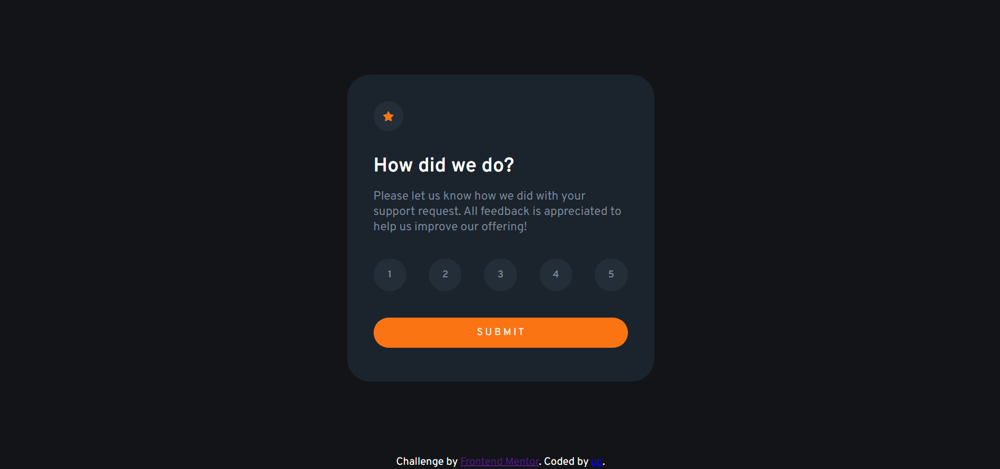

# Interactive rating component solution

This is a solution to the [Interactive rating component challenge on Frontend Mentor](https://www.frontendmentor.io/challenges/interactive-rating-component-koxpeBUmI). Frontend Mentor challenges help you improve your coding skills by building realistic projects. 

## Table of contents

- [Overview](#overview)
  - [The challenge](#the-challenge)
  - [Screenshot](#screenshot)
- [My process](#my-process)
  - [Built with](#built-with)
  - [What I learned](#what-i-learned)
- [Author](#author)


## Overview

### The challenge

Users should be able to:

- View the optimal layout for the app depending on their device's screen size
- See hover states for all interactive elements on the page
- Select and submit a number rating
- See the "Thank you" card state after submitting a rating

### Screenshot




### Links

- Live Site URL: [Interactive Rating Component](https://umeshchavda05.github.io/Interactive-rating-component/)

## My process

### Built with

- Semantic HTML5 markup
- CSS custom properties
- Flexbox
- JavaScript


### What I learned


```js
document.getElementById("submit").addEventListener("click", thankScreen)

function thankScreen(){
    
    document.getElementById("container-after").style.display = "flex"
    document.getElementById("container").style.display = "none"
    
}
```

## Author

- Github - [Umesh](https://github.com/umeshchavda05)
- Frontend Mentor - [@umeshchavda05](https://www.frontendmentor.io/profile/umeshchavda05)
